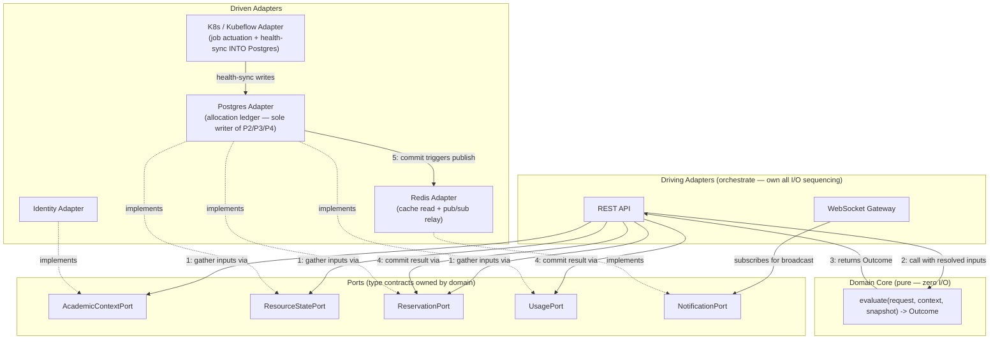
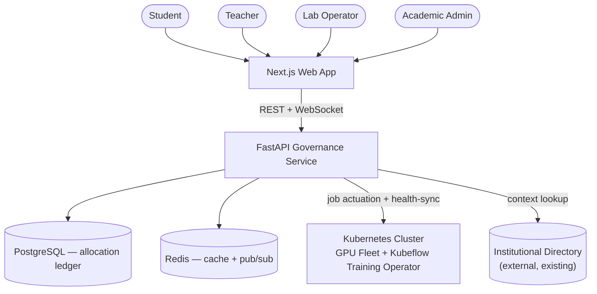
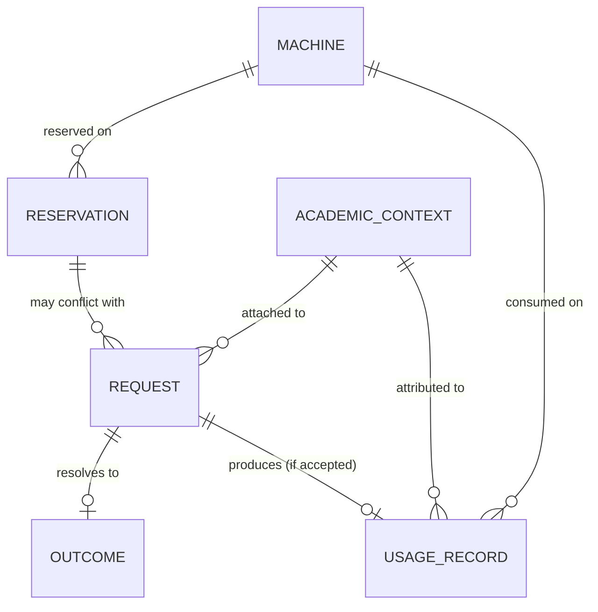

# Architecture Spine — GPU Governance Platform

## Design Paradigm

**Hexagonal (Ports & Adapters) around a pure, side-effect-free deterministic core.** The success signal itself — *identical request + unchanged state ⇒ identical outcome* — is a determinism guarantee, so the decision logic must be isolatable from every I/O concern that could make it non-reproducible.

- **Core** (`domain/`) — the policy engine: `evaluate(request, context, snapshot) -> Outcome`. Pure function: takes already-resolved inputs, returns a value, makes no calls of its own. No framework, no DB, no K8s SDK, no clock/network/random access inside it.
- **Ports** (`domain/ports/`) — interfaces the core's *inputs and outputs are typed against*, owned by domain: `AcademicContextPort`, `ResourceStatePort`, `ReservationPort`, `UsagePort`, `NotificationPort`. The core depends on these as type contracts, not as things it calls — see the orchestration flow below.
- **Driven adapters** (`adapters/`) — implement ports: `postgres/` (allocation ledger, reservations, policy config, usage log, context cache — the authoritative writer for `ResourceStatePort`, `ReservationPort`, `UsagePort`), `k8s/` (K8s API + Kubeflow CRDs — job/pod actuation, and a health-sync process that feeds machine health *into* the Postgres ledger, never consulted live in place of it), `redis/` (fleet-state read cache + pub/sub relay — implements `NotificationPort`), `identity/` (institutional directory client — implements `AcademicContextPort`).
- **Driving adapters** (`api/`) — orchestrate a request: FastAPI HTTP routers, WebSocket gateway. These call the ports to gather inputs, call the pure core, then call the ports again to commit/notify based on the result. They own all I/O sequencing; the core owns none.

## Invariants & Rules



### AD-1 — Outcome is a closed four-way contract

- **Binds:** CAP-2, CAP-3, CAP-4, CAP-6, CAP-7, CAP-12; every evaluation path
- **Context & Problem:** SPEC.md's Contract requires every request to resolve to exactly one of four outcomes. Left unfixed, adapters or endpoints could add a fifth variant over time (a "Pending"/"Held" status is the concretely anticipated risk, since CAP-4 explicitly forbids holding) — silently breaking the determinism success signal.
- **Decision Taken:** `Outcome` is a closed sum type. No adapter or endpoint introduces a new variant without amending this AD.
- **Status:** Accepted
- **Consequences & Trade-offs:** Gained — every consumer can exhaustively pattern-match on 4 cases forever; the determinism success signal is enforceable by type, not convention. Sacrificed — a legitimate future need (e.g. queuing) requires explicitly amending this AD rather than quietly adding a variant; that friction is intentional.
- **Rejected Alternatives:** An open/extensible outcome enum, adapters free to add variants as needed — rejected because it is exactly the drift this spine exists to prevent, and a 5th "held/pending" status was a concrete anticipated risk, not a hypothetical.
- **Rule:** `Outcome` is a closed sum type — `Accepted | Denied(NotAuthorized) | Denied(ResourceUnavailable) | Denied(ReservationConflict)`. No adapter or endpoint introduces a new variant without amending this AD. Infrastructure failures (DB unreachable, K8s timeout, identity-directory timeout) are **not** a `Denied` variant — they surface as an out-of-band 5xx/error response outside this closed type. The four outcomes exist only for business-rule decisions made on complete information.

### AD-2 — Evaluation is synchronous and single-pass

- **Binds:** CAP-4; all request types (access/usage, job-execution, reservation)
- **Context & Problem:** CAP-4 requires a Resource Unavailable denial to be terminal — never held, queued, or auto-retried. Left unfixed, an implementer could add background retry "to be helpful," silently violating the success signal and SPEC's explicit non-goal on queuing this iteration.
- **Decision Taken:** the orchestrating driving adapter returns within the request/response cycle that invoked it; no holding, queuing, scheduled re-evaluation, or silent retry-on-conflict.
- **Status:** Accepted
- **Consequences & Trade-offs:** Gained — matches SPEC's explicit non-goal (no queuing this iteration) and keeps the concurrency story simple (row-locking per AD-4, not retry loops). Sacrificed — no automatic "try again when it frees up" convenience for the requester; deliberate, not an oversight (queuing is an explicit open question for a future iteration).
- **Rejected Alternatives:** An async job queue that retries a resource-unavailable request in the background — rejected, directly contradicts CAP-4's "no holding, queuing, or rescheduling."
- **Rule:** the orchestrating driving adapter returns within the HTTP request/response cycle that invoked it. No adapter holds, queues, schedules a re-evaluation of the same request, or silently retries a transaction on conflict (see AD-4 — locking, not optimistic retry, is how concurrency is handled, so this rule is never in tension with it).

### AD-3 — Reservations are state, not a parallel code path

- **Binds:** CAP-5, CAP-6
- **Context & Problem:** reservations feel like a distinct feature, so it's tempting to build reservation-conflict checking as its own service/code path separate from general-use evaluation — risking a second conflict-checker that disagrees with the first about what counts as a conflict.
- **Decision Taken:** `ReservationPort` data is folded into the same `snapshot` passed to `evaluate()`; conflict detection runs through the one core function.
- **Status:** Accepted
- **Consequences & Trade-offs:** Gained — one place to reason about "does this request conflict with anything," CAP-6's determinism guarantee holds automatically. Sacrificed — the core function's snapshot input always carries reservation data, even for requests that will never conflict — a small unconditional cost on every call.
- **Rejected Alternatives:** A separate `ReservationService` with its own conflict-check path called before/after `evaluate()` — rejected because two independently-built conflict-checkers are exactly the drift the hexagonal-core paradigm exists to prevent.
- **Rule:** `ReservationPort` data is gathered into the same `snapshot` value passed to `evaluate()` as `ResourceStatePort` data. Reservation-conflict detection runs through the same core function as every other evaluation — never a parallel reservation-service code path.

### AD-4 — PostgreSQL is the sole authority for allocation state; K8s never substitutes for it at decision time

- **Binds:** CAP-5, CAP-6, CAP-9; `ResourceStatePort`, `ReservationPort`
- **Context & Problem:** two concurrent requests could both believe they're allocating the same GPU if the system read K8s live state (async, eventually-consistent) as the decision source at evaluation time, or used optimistic-concurrency retry that silently converts a clean denial into a delayed/retried one.
- **Decision Taken:** Postgres allocation ledger is the sole implementer of `ResourceStatePort`/`ReservationPort`; K8s only health-syncs *into* it; acceptance uses `READ COMMITTED` + an explicit row lock in one transaction — never `SERIALIZABLE`+retry.
- **Status:** Accepted
- **Consequences & Trade-offs:** Gained — no split-brain, no double-allocation race, one auditable source of truth matching CAP-9's usage-record requirement. Sacrificed — row-locking creates real (if brief) contention on hot resources under concurrent load; an optimistic scheme would have less lock contention at the cost of occasional wasted work and more complex failure handling.
- **Rejected Alternatives:** (a) Reading K8s live at decision time as the resource-state source — rejected as async/eventually-consistent, exactly the split-brain risk this AD closes. (b) `SERIALIZABLE` isolation with retry-on-conflict — rejected because AD-2 requires a denial to be a single deterministic terminal decision; transparently retrying on conflict risks silently converting a clean "resource unavailable" or "reservation conflict" outcome into a delayed one.
- **Rule:** `ResourceStatePort` and `ReservationPort` are implemented **only** by the `postgres` adapter, reading an allocation ledger table this platform owns — never a live K8s read substituted at decision time. The `k8s` adapter's health-sync process is the *only* way K8s-observed reality (a node going `failing`, a pod dying outside the platform's control) enters that ledger, and it does so by writing to Postgres like any other state change — which means it is itself subject to AD-8's commit-triggers-publish rule, no separate path needed. An acceptance that consumes or reserves a resource: (a) opens one transaction at `READ COMMITTED`, (b) takes an explicit row lock (`SELECT ... FOR UPDATE`) on the target machine/reservation row(s) as part of gathering the snapshot, (c) writes the allocation, (d) commits — all within that one transaction, before anything reaches Redis or WebSocket. No adapter uses optimistic (`SERIALIZABLE` + retry-on-conflict) concurrency for this path.

### AD-5 — Academic context is resolved once, before evaluation, to a fixed shape

- **Binds:** CAP-1, CAP-2, CAP-11
- **Context & Problem:** if context resolution happened lazily or mid-decision, or adapters used different field shapes, two adapters could disagree about who a request is from mid-flight, or `evaluate()` could silently re-derive context differently than what the driving adapter logged.
- **Decision Taken:** `AcademicContextPort` resolves to one immutable value at request entry, before `evaluate()` is called, in a fixed field shape.
- **Status:** Accepted
- **Consequences & Trade-offs:** Gained — CAP-1's "resolved before evaluating" requirement is structurally guaranteed, not just conventionally true. Sacrificed — a genuinely dynamic mid-request context change (e.g. a live privilege revocation) can't be reflected within that same evaluation; it applies on the next request only.
- **Rejected Alternatives:** Resolving context lazily inside `evaluate()` itself — rejected, breaks AD-9's purity rule (a directory lookup is I/O) and would let the core silently re-derive context differently than what the driving adapter logged, breaking auditability of what context a decision was made under.
- **Rule:** `AcademicContextPort` resolves to one immutable value at request entry, gathered by the driving adapter *before* calling `evaluate()`, which receives it purely as a parameter. Fixed field shape (any adapter producing or consuming this value uses exactly these fields — extend via a new field, never a renamed or restructured one without amending this AD):

  ```text
  AcademicContext {
    user_id: uuid
    course_id: uuid
    group_id: uuid
    privilege_level: enum { student, teacher, lab_operator, admin, privileged_researcher }
  }
  ```

### AD-6 — Every outcome carries structured, cause-specific data in a fixed shape

- **Binds:** CAP-7, CAP-12, CAP-13
- **Context & Problem:** a bare error string ("access denied") satisfies nothing testable and lets different clients word the same denial differently. CAP-7 requires attributable cause, CAP-12 requires acceptance detail, and CAP-13 (added in the peer-review remediation pass) requires an optional future-availability-window field on a Resource Unavailable denial — none of these are servable from an unstructured string.
- **Decision Taken:** the `details` payload on every `Outcome` uses exactly one fixed shape per outcome type; extend via a new field only, never restructure without amending this AD. `RESOURCE_UNAVAILABLE` details gain `known_availability_window`, sourced only per AD-14 — never inferred, estimated, or looked up live.
- **Status:** Accepted
- **Consequences & Trade-offs:** Gained — every client renders every outcome without per-outcome bespoke parsing; CAP-13's addition is a pure additive superset, no breaking change for existing consumers (the field is nullable). Sacrificed — this shape is now the one place that must be amended for any future denial-detail need; no adapter may add ad hoc fields of its own.
- **Rejected Alternatives:** A bare string message per outcome — rejected as untestable and unstructured (see AD-13, which exists precisely because structured `details` and human-readable copy are different concerns, both needed). For CAP-13 specifically: exposing the future window via a separate lookup endpoint instead of the same denial response — rejected, forces every client into a second round-trip for information the system already has at decision time.
- **Rule:** the `details` payload on every `Outcome` uses exactly this shape (extend via a new field, never restructure without amending this AD):

  ```text
  Denied {
    reason_code: enum { NOT_AUTHORIZED, RESOURCE_UNAVAILABLE, RESERVATION_CONFLICT }
    details: {
      rule_id: string            # the specific rule/quota/restriction that fired
      resource_id: uuid | null
      conflicting_reservation_id: uuid | null   # set only for RESERVATION_CONFLICT
      known_availability_window: { start: iso8601 } | null   # RESOURCE_UNAVAILABLE only; see AD-14 for sourcing rule
    }
  }

  Accepted {
    resource_id: uuid
    window: { start: iso8601, end: iso8601 | null }
    expiry: iso8601 | null
  }
  ```

  A bare string is never substituted for `details` at any layer, including the UI.

### AD-7 — Usage recording is transactionally coupled to acceptance

- **Binds:** CAP-9
- **Context & Problem:** CAP-9's success signal requires *every* accepted request to produce a queryable usage record. A fire-and-forget post-response write can be silently lost on a crash between "response sent" and "record written," leaving an accepted request with no record.
- **Decision Taken:** the usage-record write happens in the same transaction as the allocation commit (AD-4).
- **Status:** Accepted
- **Consequences & Trade-offs:** Gained — CAP-9's "every accepted request" guarantee is structurally unbreakable by a crash between steps. Sacrificed — the accept transaction is slightly larger/longer-held (usage write inside AD-4's lock window) than a fire-and-forget design would need.
- **Rejected Alternatives:** Fire-and-forget async usage write after the response is sent — rejected, can silently lose records on crash/restart, directly violating CAP-9's "every accepted request" wording (not "usually").
- **Rule:** the usage-record write happens in the same transaction as the allocation commit (AD-4) — never a fire-and-forget write after the response is sent.

### AD-8 — State-change commits drive the real-time feed through one named mechanism; clients never poll for it

- **Binds:** CAP-8; `NotificationPort`
- **Context & Problem:** multiple writers (the main request flow, K8s health-sync, a reservation-expiry sweep) all change machine/reservation state. If each independently decided whether/when to notify Redis, duplicate or missed broadcasts follow — and expiry (a passive passage of time) has no natural "writer" unless something explicitly triggers it.
- **Decision Taken:** one shared commit-and-publish helper owned by the `postgres` adapter; every state-changing write goes through it and it alone calls `redis.publish()`; a scheduled expiry sweeper transitions expired reservations through this same helper.
- **Status:** Accepted
- **Consequences & Trade-offs:** Gained — CAP-8's real-time guarantee has exactly one code path to audit; no missed/duplicate broadcasts possible by construction. Sacrificed — every future writer of this state (including ones not yet imagined) must route through this one helper — a deliberate chokepoint that must not become a bottleneck as write volume grows.
- **Rejected Alternatives:** (a) Each adapter independently calling `redis.publish()` after its own writes — rejected, duplicate/inconsistent broadcast risk. (b) Computing reservation-expiry only at read time, no explicit transition — rejected, expiry is a real state change CAP-8's clients need pushed to them, not something they'd see only if they happened to poll/reconnect at the right moment.
- **Rule:** the `postgres` adapter exposes one shared commit-and-publish helper; every write that changes machine, reservation, or allocation status goes through it, and it alone calls `redis.publish()` immediately after the transaction commits — no other code path publishes. This includes: (a) the k8s adapter's health-sync writes (AD-4), and (b) a scheduled reservation-expiry sweeper that transitions an expired reservation via this same helper — expiry is a real state transition requiring a commit, never a value computed only at read time. The WebSocket gateway is the only subscriber that fans out to clients.

### AD-9 — Dependency direction and purity: the domain core imports and calls nothing beyond its parameters

- **Binds:** all
- **Context & Problem:** the determinism success signal (identical request + unchanged state ⇒ identical outcome) is unenforceable if the core can call a clock, RNG, DB, or K8s client itself — any of those makes two calls with "the same" inputs potentially produce different outputs.
- **Decision Taken:** `domain/` (core + ports) imports none of FastAPI, the K8s client, the Postgres driver, redis-py, or Python's `datetime`/`time`/`random`/`uuid` stdlib; every value that could vary between calls is produced by the driving adapter and passed in as a parameter.
- **Status:** Accepted
- **Consequences & Trade-offs:** Gained — determinism is enforceable by import-linting the core, not just promised in prose; the core is trivially unit-testable with no mocks. Sacrificed — every value a naive implementation would reach for directly (current time, a new UUID) must be explicitly threaded in as a parameter, adding boilerplate at every call site.
- **Rejected Alternatives:** Allowing the core to call `datetime.now()` directly for time-window checks (CAP-3) since "it's just reading the clock, not really I/O" — rejected as exactly the rationalization that breaks reproducibility; two calls with "the same" business inputs at different real times would then legitimately produce different outcomes, contradicting the success signal itself.
- **Rule:** `domain/` (core + ports) imports none of: FastAPI, the K8s client, the Postgres driver, redis-py, or Python's `datetime`/`time`/`random`/`uuid` stdlib modules. Any value that could vary between two calls with "the same" business inputs (current time, a generated id) is produced by the driving adapter and passed in as part of `request`/`context`/`snapshot`. Adapters depend inward on port interfaces; the composition root (app startup) is the only place concrete adapters are wired to ports.

### AD-10 — Evaluation precedence when multiple denial conditions hold

- **Binds:** CAP-2, CAP-3, CAP-4, CAP-6, CAP-11; `evaluate()`
- **Context & Problem:** multiple denial conditions (authorization, reservation conflict, unavailability) can simultaneously hold for one request. Without a fixed check order, two independently-built implementations could return different Outcomes for the identical request+state depending on which check they wrote first — breaking determinism itself and CAP-2's explicit "denied Not Authorized regardless of resource availability."
- **Decision Taken:** `evaluate()` checks in a fixed order and returns on the first match: authorization-class checks, then reservation conflict, then availability, else Accepted.
- **Status:** Accepted
- **Consequences & Trade-offs:** Gained — determinism holds even when multiple denial reasons are simultaneously true; CAP-2's literal wording is satisfied by construction. Sacrificed — a request that's both unauthorized and would've hit a reservation conflict only ever surfaces the authorization reason; the requester never learns about the second, latent problem until they fix the first and resubmit.
- **Rejected Alternatives:** Returning all applicable denial reasons at once (a list, not a single cause) — rejected because CAP-7 requires "the specific attributable cause" (singular) and AD-1's Outcome type is a closed four-way, not a set — a multi-cause response would require reopening AD-1 for no requirement that asked for it.
- **Rule:** `evaluate()` checks in this fixed order and returns on the first match:
  1. **Authorization-class checks** — model/service/workload-tier authorization (CAP-2), workload-type time-window and authorized-user restrictions (CAP-3), privileged-resource authorization (CAP-11). Any failure here returns `Denied(NotAuthorized)` regardless of resource state.
  2. **Reservation conflict** (CAP-6) — checked before generic availability because it is the more specific cause.
  3. **Resource availability** (CAP-4) — the fallback denial when nothing above fired but no resource satisfies the request.
  4. Otherwise, `Accepted`.

### AD-11 — Driving adapters may bypass the core only for reads that carry no authorization decision

- **Binds:** CAP-8, CAP-10; `api/http`, `api/ws`
- **Context & Problem:** CAP-8 (status) and CAP-10 (usage summary) are reads that don't need a business-rule decision — routing every read through `evaluate()` would be pure overhead and conceptually wrong. But left fully open, this also risks authorization logic getting re-implemented ad hoc in an HTTP handler instead of routed through the core.
- **Decision Taken:** a driving adapter may bypass `evaluate()` only for reads gated on nothing but existence; any read whose result depends on the requester's privilege relative to *someone else's* data reuses `evaluate()`'s own authorization checks (AD-5, AD-10).
- **Status:** Accepted
- **Consequences & Trade-offs:** Gained — cheap reads stay cheap, while cross-user reads can't accidentally skip authorization. Sacrificed — this AD requires ongoing judgment ("does this read depend on someone else's data?") rather than a single mechanical rule; a new read endpoint always needs this AD consulted explicitly.
- **Rejected Alternatives:** Routing every read (including simple status checks) through `evaluate()` uniformly — rejected as needless overhead for reads that carry no actual authorization decision, and awkward to model (`evaluate()` is shaped around requests that get accepted/denied, not passive reads).
- **Rule:** a driving adapter may call a driven adapter directly, skipping `evaluate()`, only for a read that gates on nothing but "does this data exist" (machine status display, a user's own usage summary). Any read whose result depends on the requester's academic-context privilege relative to *someone else's* data (e.g. a teacher viewing a student's usage, an admin viewing cross-course reports) reuses the same authorization checks `evaluate()` applies (AD-5, AD-10) — it does not invent a separate inline check.

### AD-12 — Platform runs in-cluster under least-privilege RBAC

- **Binds:** deployment envelope; `k8s` adapter
- **Context & Problem:** a governance layer that mediates access to the GPU fleet is an obvious target to over-grant ("just give it cluster-admin, it needs to see everything anyway") — which would make the governance service itself a bigger blast radius than the fleet it's meant to protect.
- **Decision Taken:** the service runs in-cluster under a dedicated `ServiceAccount` scoped to exactly the resources the `k8s` adapter touches — never a wildcard or admin-equivalent binding.
- **Status:** Accepted
- **Consequences & Trade-offs:** Gained — a compromise of the governance service can't be leveraged to escalate across the whole cluster. Sacrificed — every new K8s resource type the `k8s` adapter needs later requires an explicit RBAC grant, not implicit access — ongoing maintenance cost, deliberately.
- **Rejected Alternatives:** Cluster-admin or namespace-admin as a deployment shortcut — rejected; trades a one-time setup convenience for a permanent, disproportionate security exposure.
- **Rule:** the service runs inside the same Kubernetes cluster as the GPU fleet, under a dedicated `ServiceAccount` whose RBAC `Role`/`ClusterRole` is scoped to exactly the resources the `k8s` adapter touches (GPU-fleet nodes/pods, Kubeflow training-job CRDs) — never a wildcard or admin-equivalent binding. Exact role definition is Deferred (SPEC non-goal: final deployment architecture), but "least privilege, not admin" is not.

### AD-13 — Tone-compliant message composition is server-side and singular

- **Binds:** CAP-7, CAP-12; the REST envelope's `message` field
- **Context & Problem:** SPEC's `tone-of-voice.md` companion defines precise, calm/non-punitive wording rules. With two clients (web dashboard, mobile companion view) both reading the same structured `details`, each composing its own human-readable copy risks drifting in wording and in tone compliance over time.
- **Decision Taken:** the `api/http` orchestration layer composes the human-readable `message` string exactly once per response, resolving any ids in `details` via the `postgres` adapter and applying `tone-of-voice.md`'s rules; every client renders it verbatim.
- **Status:** Accepted
- **Consequences & Trade-offs:** Gained — tone consistency is enforced by construction, not by asking two separate frontend teams to both remember the style guide. Sacrificed — a client can't customize denial wording for its own UX needs (e.g. a terser mobile phrasing) without a server-side change; message composition is no longer a client-local concern.
- **Rejected Alternatives:** Each client composing its own message from structured `details` — rejected, exactly the drift risk this AD exists to prevent, and duplicates id-resolution logic (course name, machine label) in every client instead of once.
- **Rule:** the `api/http` orchestration layer composes the human-readable `message` string exactly once per response, after `evaluate()` returns — resolving any ids in `details` (e.g. `conflicting_reservation_id` → course name, `resource_id` → machine label) via the `postgres` adapter, and applying `tone-of-voice.md`'s rules. Every client renders that `message` verbatim; no client re-derives or re-words it from `details` itself.

### AD-14 — Future-availability window is computed from the evaluation snapshot, never a live lookahead query

- **Binds:** CAP-13; `ReservationPort`, `evaluate()`
- **Context & Problem:** CAP-13 (added in the peer-review remediation pass) requires a `Denied: Resource Unavailable` response to state a future availability window when reservation data already shows one. Left unfixed, two independently-built implementations could diverge: one computes this from the same read-locked snapshot `evaluate()` already has, the other issues a separate live query for "the next free slot" — a slower, non-deterministic, potentially racy second lookup outside the transaction AD-4 defines.
- **Decision Taken:** `evaluate()` derives `known_availability_window` purely from the `ReservationPort` data already present in the `snapshot` parameter it received (the same snapshot AD-3 already folds reservation data into) — no additional query, no lookahead beyond what the snapshot contains. If no future reservation for the requested resource exists in that snapshot, the field is `null`; the core never estimates, interpolates, or predicts one.
- **Status:** Accepted
- **Consequences & Trade-offs:** Gained — full consistency with AD-9's purity guarantee (no new I/O inside the core) and AD-4's single-snapshot transaction boundary; the returned window is always trustworthy as of the same instant the denial was decided. Sacrificed — a reservation created moments after the snapshot was taken won't be reflected in this denial (already true of every other field in the same response, per AD-2, so this isn't a new inconsistency); the disclosed window is opportunistic — only the requested resource's own next reservation, not a search across other equivalent machines.
- **Rejected Alternatives:** (a) A live "find the next free window" query run by the driving adapter after `evaluate()` returns — rejected, reopens the split-brain/non-atomicity class of bug AD-4 exists to close, and duplicates reservation-reading logic outside the one function meant to own it. (b) Computing the window as a background/async job and caching it — rejected, AD-2 already forbids anything but a synchronous, single-pass, terminal decision for this outcome; a cached "next available" prediction is exactly the kind of held/inferred state CAP-4 and AD-1 exist to prevent.
- **Prevents:** a driving adapter or separate service independently computing "when's it free next" via its own query, producing an answer that can disagree with what the core already knows from the same snapshot, or reintroducing async/lookahead state the rest of the spine forbids
- **Rule:** `known_availability_window` (AD-6) is set to the start time of the earliest future `ReservationPort` entry for the requested resource already present in `snapshot`, or `null` if none exists in that snapshot. No adapter queries for this value separately from the snapshot `evaluate()` was called with.

## Consistency Conventions

| Concern | Convention |
| --- | --- |
| Naming (entities, files, interfaces, events) | Domain entities PascalCase (`Request`, `Outcome`, `AcademicContext`, `Reservation`, `MachineStatus`, `UsageRecord`); ports suffixed `Port`; adapters suffixed `Adapter`; outcome reason codes UPPER_SNAKE (`NOT_AUTHORIZED`, `RESOURCE_UNAVAILABLE`, `RESERVATION_CONFLICT`) matching the SPEC's literal outcome names. |
| Data & formats (ids, dates, error shapes, envelopes) | IDs = UUIDv4 strings. Timestamps = ISO 8601 UTC. Every REST response uses one envelope shape: `{status, reason_code?, message, details}` (AD-6 fixes `details`). WebSocket messages use one event envelope: `{event_type, machine_id | reservation_id, status, occurred_at}` — a distinct convention from the REST envelope, not reused ad hoc per message type. No monetary/billing field exists anywhere in any schema (non-goal enforcement). |
| State & cross-cutting (mutation, errors, logging, config, auth) | State mutation for allocation decisions only happens through the postgres adapter's shared commit-and-publish helper (AD-8) — no adapter writes allocation state directly outside it. The `kubernetes` client (36.0.3) is synchronous; every `k8s` adapter call runs via `run_in_threadpool`/`asyncio.to_thread`, never awaited directly against the event loop. Structured JSON logs correlated by `request_id`. Config via environment variables (pydantic-settings). Auth: bearer token validated against the institutional directory via `AcademicContextPort`; the platform never issues or stores passwords (SPEC assumption: identity already exists externally). |

## Stack

| Name | Version |
| --- | --- |
| Python | 3.14.7 |
| FastAPI | ~0.141 (pre-1.0, active release train — re-verify against PyPI at implementation start) |
| kubernetes (python client) | 36.0.3 — synchronous; see Consistency Conventions for the threadpool rule |
| asyncpg | 0.31.0 (async Postgres driver; avoid transaction-mode connection poolers like pgbouncer in front of it — they break session-scoped row locks AD-4 depends on) |
| Next.js | 16.3.3 (current stable; requires Node.js ≥ 20.9 — a deployment-image implication) |
| React | 19.x as bundled by Next.js 16's App Router (tracks a 19.2-class release, not a separate pin) |
| Tailwind CSS | 4.3.3 |
| PostgreSQL | 18.6 |
| Redis (server) | 8.10.1 |
| redis-py (client) | 8.1.0 — confirm its published compatibility matrix covers server 8.10.x before implementation; not yet independently verified here |
| Kubeflow | Training Operator-class CRDs — **exact API group (v1 `kubeflow.org/v1` TFJob/PyTorchJob vs v2 `trainer.kubeflow.org` TrainJob) is a Deferred item; see below.** |

## Structural Seed





```text
{root}/
  domain/            # pure core: entities + evaluate(), zero framework/infra imports (AD-9)
    ports/           # interfaces the core's inputs/outputs are typed against, owned by domain
  adapters/
    postgres/        # allocation ledger (source of truth — AD-4), commit-and-publish helper (AD-8)
    k8s/             # job actuation + health-sync INTO postgres (driven; never a live decision-time read)
    redis/           # cache read + pub/sub relay (driven, implements NotificationPort)
    identity/        # institutional directory client (driven, implements AcademicContextPort)
  api/
    http/            # FastAPI routers — orchestrate: gather inputs, call evaluate(), commit result (driving)
    ws/              # WebSocket gateway — subscribes to Redis, fans out (driving)
  web/               # Next.js frontend — separate deployable
```

**Deployment & operational envelope:** see AD-12 for the RBAC invariant. Exact RBAC role definition, environment count (dev/staging/prod), and CI/CD pipeline are Deferred (SPEC non-goal: final deployment architecture). Metrics/tracing/alerting beyond structured request-correlated logging (Consistency Conventions) are Deferred, not yet decided.

## Capability → Architecture Map

| Capability | Lives in | Governed by |
| --- | --- | --- |
| CAP-1 (context before evaluation) | `api/http` orchestration + `identity` adapter | AD-5 |
| CAP-2 (deny unauthorized) | `domain` core | AD-1, AD-5, AD-10 |
| CAP-3 (time-window / user-set restriction) | `domain` core | AD-10 — AND/OR combination logic Deferred |
| CAP-4 (deny unavailable, no queue) | `domain` core + `ResourceStatePort` | AD-2, AD-4, AD-10 |
| CAP-5 (create reservation) | `ReservationPort` → `postgres` adapter | AD-3, AD-4 |
| CAP-6 (conflict detection) | `domain` core (reservation is part of the snapshot) | AD-3, AD-4, AD-10 |
| CAP-7 (attributable denial cause) | `domain` core `Outcome` shape | AD-6 |
| CAP-8 (machine status report) | `k8s` adapter → `postgres` ledger → `redis` cache → `api/ws` | AD-4, AD-8, AD-11 |
| CAP-9 (usage recording) | `UsagePort` → `postgres` adapter | AD-7 |
| CAP-10 (usage summary) | `postgres` adapter query + `api/http` (bypasses core per AD-11) | AD-11 |
| CAP-11 (privileged-resource restriction) | `domain` core authorization rules | AD-1, AD-5, AD-10 |
| CAP-12 (acceptance detail) | `domain` core `Outcome` shape | AD-6 |
| CAP-13 (future-window disclosure on denial) | `domain` core `Outcome.details` shape, sourced from `ReservationPort` snapshot | AD-6, AD-14 |

## Deferred

- **Kubeflow CRD API version** — SPEC locks "Training Operator-style" distributed training as context, not a design choice, but the ecosystem has since split into Training Operator V1 (`kubeflow.org/v1`, TFJob/PyTorchJob, latest v1.8.0) and Kubeflow Trainer V2 (`trainer.kubeflow.org`, TrainJob, v2.2 as of March 2026) — different CRDs. Verify which is installed on the actual university cluster before binding the `k8s` adapter's distributed-training path.
- redis-py's published compatibility matrix vs. Redis server 8.10.1 — confirm before implementation (see Stack table).
- Exact RBAC role definition for the platform's `ServiceAccount` (AD-12 fixes "least privilege," not the exact rules).
- Environment topology and CI/CD pipeline beyond "runs in-cluster" (SPEC non-goal).
- Metrics, tracing, and alerting strategy beyond structured logging (not yet decided, not yet needed to prevent divergence at this altitude).
- Exact database schema (SPEC non-goal) — AD-4/AD-5/AD-6 constrain the allocation-ledger transaction shape and the `AcademicContext`/`Outcome` field contracts; the schema itself is code's to own.
- `RESOURCE_UNAVAILABLE` sub-code granularity (e.g. distinguishing "wrong VRAM tier" from "quota exceeded") — AD-6 fixes the envelope, not how finely `rule_id` values are split; a UX-driven choice, not a state-integrity one.
- Institutional directory integration protocol (LDAP/SAML/OIDC/other) — SPEC assumes the directory exists but doesn't name the protocol.
- Role-based visibility of machine status beyond lab operators (open question in SPEC, CAP-8) — `api/http`/`api/ws` authorization scope for status endpoints, not yet decided.
- Request queuing/waitlisting — explicit SPEC non-goal this iteration; AD-2 assumes synchronous-only. Revisit AD-2 if this changes.
- Preemption of a running job by a later, higher-priority reservation — SPEC assumption says no; would need a new AD (and likely a new `Outcome` variant, reopening AD-1) if added later.
- Academic-context structure beyond "one attribute set per request" (course + group + privilege) — SPEC flags this as a risky assumption; AD-5's fixed shape would need to change first if multi-enrollment support is ever required.
- **Fleet-wide "workload distribution" visibility for Lab Operators** — `stakeholders.md` names this need explicitly, but SPEC.md's CAP-8 only covers per-machine status (available/reserved/busy/idle/failing), not which workloads are running where or load spread across nodes. This is a SPEC/companion scope mismatch, not something architected here — SPEC controls scope for this spine. Revisit by either amending SPEC.md to add a capability for it, or confirming it's out of scope for this iteration.
